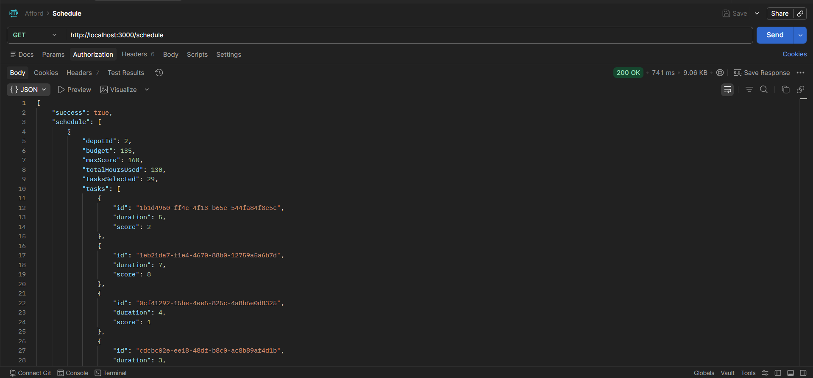
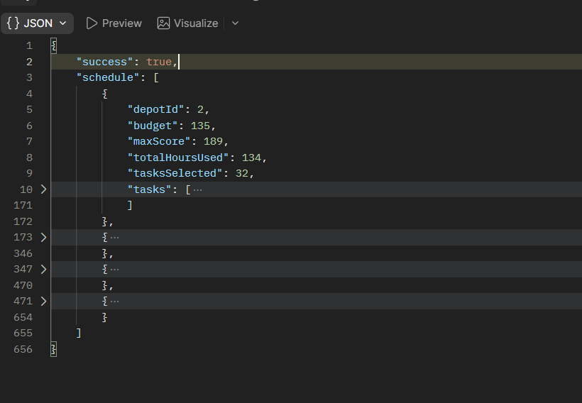
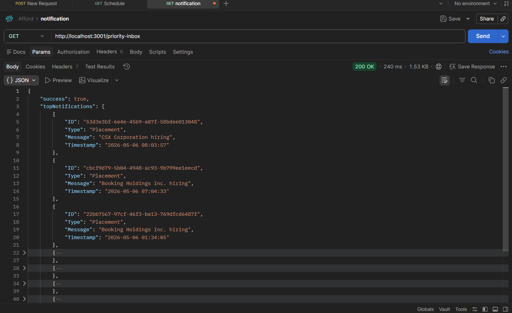

# CB.SC.U4CSE23101

1. vehicle maintenance scheduler
2. notification priority inbox.

### Authentication
before running, paste auth token in .env file as `LOG_AUTH_TOKEN` environment variable, or create `credentials.json` file with registered details (`clientID`, `clientSecret`, `email` , `name`, `rollNo`, `accessCode`). 

`npm install`

### Starting Vehicle Scheduling

`node vehicle_scheduling/index.js`

### Starting Priority Inbox

`node notification_app_be/index.js`

## test screenshots

### vehicle scheduling API
#### GET http://localhost:3000/schedule

#### GET http://localhost:3001/priority-inbox

### priority inbox API

